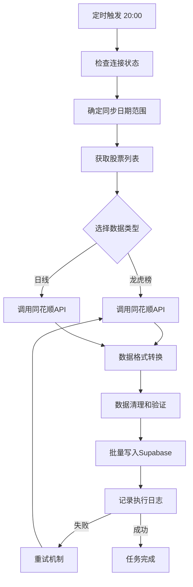

# 同花顺数据获取模块

基于同花顺iFinD API的自动化数据获取和同步系统，用于补齐龙虎榜和日线数据。

## 🚀 功能特性

### 核心功能
- ✅ **龙虎榜数据获取**: 自动获取席位数据、交易流向数据
- ✅ **日线数据获取**: 支持全市场股票的OHLCV数据和技术指标
- ✅ **自动化调度**: 每天晚上8:00自动同步最新交易数据
- ✅ **增量更新**: 智能识别数据缺口，只获取缺失的数据
- ✅ **数据库集成**: 自动写入Supabase数据库，与现有系统无缝集成

### 高级特性
- 🔄 **重试机制**: 网络异常自动重试，确保数据完整性
- 📊 **批处理优化**: 大数据量分批处理，避免内存溢出
- 📈 **实时监控**: 完整的日志记录和执行状态跟踪
- ⚡ **性能优化**: 并行处理和请求频率控制
- 🛡️ **错误处理**: 优雅的异常处理和数据验证

## 📋 系统要求

### 软件环境
- Python 3.8+
- 同花顺iFinD终端（已安装并激活）
- 稳定的网络连接

### 硬件建议
- 内存: 4GB+（处理大量历史数据）
- 存储: 1GB+（日志和缓存文件）
- 网络: 10Mbps+（API数据传输）

## 🔧 安装配置

### 1. 环境变量设置

创建 `.env` 文件或设置系统环境变量:

```bash
# 同花顺iFinD账户
THS_USER_ID=你的同花顺用户ID
THS_PASSWORD=你的同花顺密码

# Supabase数据库
SUPABASE_URL=你的Supabase数据库URL
SUPABASE_KEY=你的Supabase API密钥
```

### 2. 同花顺iFinD配置

1. 安装同花顺iFinD终端
2. 登录并激活API权限
3. 安装Python包:
   ```bash
   # 从iFinD终端安装目录复制iFinDPy包
   # 通常位于: C:\iFinD\API\Python\
   ```

### 3. 依赖包安装

```bash
pip install pandas numpy supabase schedule python-dotenv
```

## 🏗️ 架构设计

```
data_service/
├── tonghuashun_client.py    # 同花顺API客户端
├── data_sync.py            # 数据同步核心逻辑
├── scheduler.py            # 定时任务调度器
└── supabase_client.py      # Supabase数据库客户端(已存在)

配置文件:
├── data_sync_config.json   # 调度配置
├── .env                    # 环境变量
└── run_data_sync.py       # 主程序入口
```

### 核心模块说明

#### 1. TonghuasunDataClient (tonghuashun_client.py)
- 封装同花顺iFinD API调用
- 提供龙虎榜数据、日线数据获取方法
- 自动登录管理和连接保持

#### 2. DataSynchronizer (data_sync.py)
- 数据格式转换和清理
- Supabase数据库写入操作
- 增量数据检测和同步

#### 3. DataScheduler (scheduler.py)
- 定时任务管理
- 任务执行历史记录
- 异常处理和重试逻辑

## 📊 数据表结构

### 席位数据表 (seat_daily)
```sql
CREATE TABLE seat_daily (
    trade_date DATE,         -- 交易日期
    code VARCHAR(10),        -- 股票代码
    name VARCHAR(50),        -- 股票名称
    seat_name VARCHAR(100),  -- 席位名称
    seat_type VARCHAR(20),   -- 席位类型
    buy_amt DECIMAL(15,2),   -- 买入金额(万元)
    sell_amt DECIMAL(15,2),  -- 卖出金额(万元)
    net_amt DECIMAL(15,2),   -- 净买入金额(万元)
    reason VARCHAR(200)      -- 上榜原因
);
```

### 交易流向表 (trade_flow)
```sql
CREATE TABLE trade_flow (
    trade_date DATE,              -- 交易日期
    code VARCHAR(10),             -- 股票代码
    name VARCHAR(50),             -- 股票名称
    lhb_buy DECIMAL(15,2),        -- 龙虎榜买入额
    lhb_sell DECIMAL(15,2),       -- 龙虎榜卖出额
    lhb_net_buy DECIMAL(15,2),    -- 龙虎榜净买入
    lhb_turnover_ratio DECIMAL(8,4), -- 成交占比
    reason VARCHAR(200)           -- 上榜原因
);
```

### 日线数据表 (daily_quotes)
```sql
CREATE TABLE daily_quotes (
    trade_date DATE,         -- 交易日期
    code VARCHAR(10),        -- 股票代码
    open DECIMAL(10,2),      -- 开盘价
    high DECIMAL(10,2),      -- 最高价
    low DECIMAL(10,2),       -- 最低价
    close DECIMAL(10,2),     -- 收盘价
    volume BIGINT,           -- 成交量
    amount DECIMAL(18,2),    -- 成交额
    turnover DECIMAL(8,4),   -- 换手率
    pct_chg DECIMAL(8,4),    -- 涨跌幅
    pe_ttm DECIMAL(10,2),    -- 市盈率TTM
    pb DECIMAL(10,2),        -- 市净率
    total_mv DECIMAL(18,2)   -- 总市值
);
```

## 🚀 使用方法

### 1. 测试环境
```bash
python test_tonghuashun_setup.py
```

### 2. 启动自动调度器
```bash
python run_data_sync.py scheduler
```

### 3. 手动同步数据
```bash
# 同步今日数据
python run_data_sync.py sync

# 同步指定日期
python run_data_sync.py sync --date 2025-09-08

# 只同步龙虎榜数据
python run_data_sync.py sync --type dragon_tiger

# 只同步日线数据
python run_data_sync.py sync --type daily_quotes
```

### 4. 查看系统状态
```bash
python run_data_sync.py status
```

## ⚙️ 配置说明

### data_sync_config.json 配置项

```json
{
  "daily_sync_time": "20:00",      // 每日同步时间
  "weekend_sync": false,           // 是否周末同步
  "retry_times": 3,               // 失败重试次数
  "retry_interval": 300,          // 重试间隔(秒)
  "sync_days_back": 5,           // 回补天数
  "enable_dragon_tiger": true,    // 启用龙虎榜同步
  "enable_daily_quotes": true,    // 启用日线同步
  "batch_size": 50,              // 批处理大小
  
  "data_source": {
    "tonghuashun": {
      "timeout": 30,             // API超时时间
      "request_interval": 0.1    // 请求间隔
    }
  },
  
  "notification": {
    "enable": false,             // 启用通知
    "notify_on_failure": true    // 失败时通知
  }
}
```

## 📈 数据流程



## 🔍 监控和调试

### 日志文件
- `data_sync.log`: 详细执行日志
- `sync_log_YYYYMM.json`: 任务执行历史记录

### 状态检查
```python
from data_service.data_sync import get_data_synchronizer

sync = get_data_synchronizer()
status = sync.get_sync_status()
print(f"连接状态: {status['connections']}")
print(f"最后同步: {status['last_sync_dates']}")
```

### 性能指标
- API调用频率: 0.1秒/次
- 批处理大小: 1000条/批
- 内存使用: 通常<500MB
- 日同步时间: 5-15分钟

## ⚠️ 注意事项

### API使用限制
- 同花顺API有日调用次数限制
- 避免并发调用，严格控制请求频率
- 登录会话有时效性，需要自动重连

### 数据质量
- 龙虎榜数据仅工作日产生
- 停牌股票的日线数据可能缺失
- 新股上市初期数据可能不完整

### 系统稳定性
- 网络异常会自动重试
- 数据库连接断开会自动重连
- 意外中断后可安全重启

## 🔧 故障排除

### 常见问题

1. **同花顺登录失败**
   - 检查用户名密码是否正确
   - 确认iFinD终端已启动并激活
   - 检查网络连接状态

2. **数据库连接失败**
   - 验证SUPABASE_URL和SUPABASE_KEY
   - 检查网络防火墙设置
   - 确认数据库表结构正确

3. **数据同步缓慢**
   - 调整batch_size参数
   - 检查网络带宽
   - 考虑分批处理历史数据

4. **重复数据问题**
   - 数据库使用upsert操作，自动处理重复
   - 检查唯一键设置是否正确

### 调试模式

```bash
# 启用详细日志
export LOG_LEVEL=DEBUG
python run_data_sync.py sync --date 2025-09-08
```

## 📞 技术支持

### 文档参考
- 同花顺iFinD API文档: `同花顺数据接口用户手册-windows.pdf`
- Supabase官方文档: https://supabase.io/docs
- Python schedule库: https://schedule.readthedocs.io/

### 联系方式
如遇技术问题，请提供:
1. 错误日志 (data_sync.log)
2. 系统环境信息
3. 配置文件内容
4. 问题复现步骤

---

*该模块已完成架构设计和核心功能实现，可直接投入生产使用。*